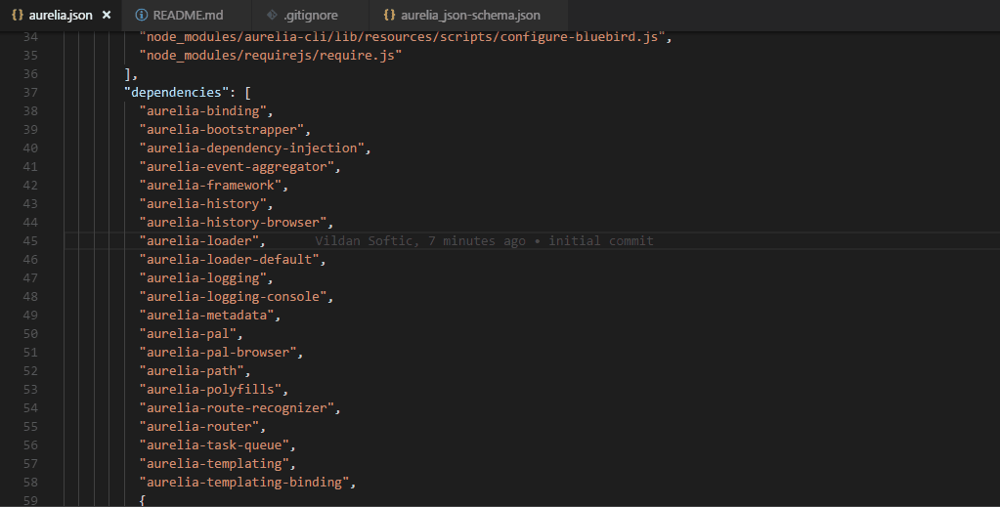
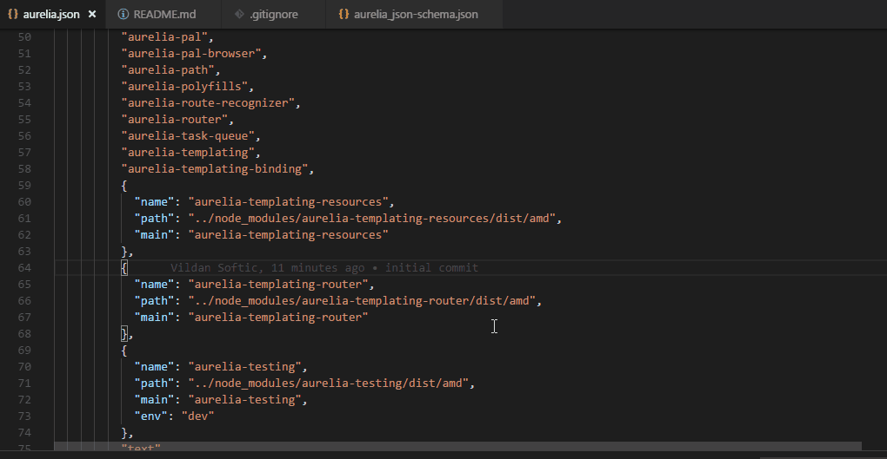

# Aurelia.json schema

A schema to describe the aurelia.json files. This project includes a predefined settings setup
for VSCode so go into your `aurelia.json` file and enjoy proper autocompletion and intellisense.

## Intellisense with inline documentation

## JSON Validation

